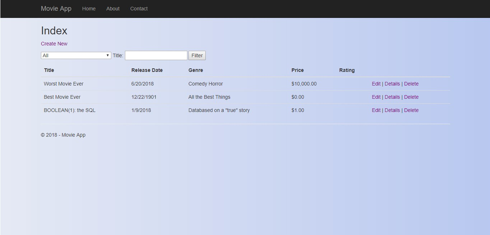
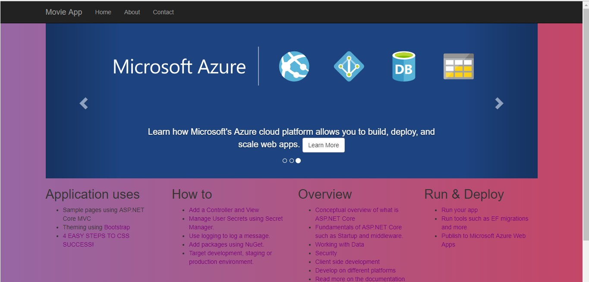

# Lab12_MVC2

## About this project
This project is a website built using MVC architecture. Through various models, views, and controllers, the user arrives on a landing page, then is able to interact with the page. The primary result of our walkthrough tutorial was in managing the creation and update of a movie database. The front end is largely bootstrapped, save for some custom css and html inserts. For the main app, a user is able to look at a list of movies, filter by genre and a search function, and finally perform CRUD operations through a view UI that then routes through controllers to affect the database model.

## Example

## How to use
This program requires Visual Studio. Once the repo has been cloned to the user's local machine, they simply need to navigate to the solution folder, and open the solution using Visual Studio. Then, run the program. After that, follow the prompts. The project will open in a seperate browser window, and the user can then interact with the different links. The exception is with the nav links aside from "Home", as the tutorial did not have us create additional controls or views for those options.

## Licensing
This program is available under the MIT license.

